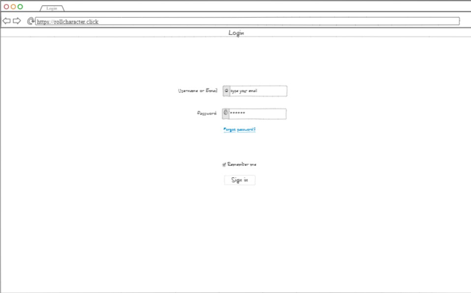

# Roll Character
## Specification Deliverable
### Elevator Pitch
Enjoy playing Dungeons and Dragons but not the hassle trying of picking your character? Or maybe you find yourself playing the same kind of character over and over again? Roll Charater allows you to virtually roll dice that give you a randomized race, class, alignment, and background! After you've rolled for your character you then are prompted to roll for stats. Once the stats have been rolled you can name your character and save them.
### Design
There will be four main pages after logging in/creating an account.

### Key Features
- A secure login using HTTPS
- Roll for character features (race, class, etc.)
- Roll for stats using 4d6 method discarding the lowest roll and adding the rest together. After each roll you can assign the stat value to an ability (dex, str, etc.)
- Naming your character
- Ability to store characters into an archive the user can access at anytime
- Add friends and chat with them using the chat box
### Technologies
- **Authentication**: Prompts user to register an account and login. Cannot access website without one. Displays username in top right corner.
- **Database Data**: Users can store their rolls into the database.
- **WebSocket**: You can friend people and send messages to each other through a chat box in the lower left corner.

[Notes](notes.md)